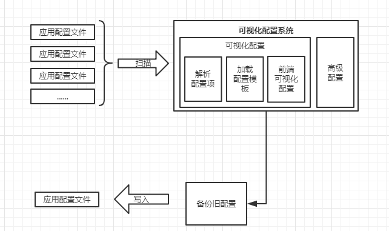

 

  <svg xmlns="http://www.w3.org/2000/svg" style="display: none;">
      <symbol id="cpu-fill" viewBox="0 0 16 16">
                <path d="M6.5 6a.5.5 0 0 0-.5.5v3a.5.5 0 0 0 .5.5h3a.5.5 0 0 0 .5-.5v-3a.5.5 0 0 0-.5-.5h-3z"/>
                <path d="M5.5.5a.5.5 0 0 0-1 0V2A2.5 2.5 0 0 0 2 4.5H.5a.5.5 0 0 0 0 1H2v1H.5a.5.5 0 0 0 0 1H2v1H.5a.5.5 0 0 0 0 1H2v1H.5a.5.5 0 0 0 0 1H2A2.5 2.5 0 0 0 4.5 14v1.5a.5.5 0 0 0 1 0V14h1v1.5a.5.5 0 0 0 1 0V14h1v1.5a.5.5 0 0 0 1 0V14h1v1.5a.5.5 0 0 0 1 0V14a2.5 2.5 0 0 0 2.5-2.5h1.5a.5.5 0 0 0 0-1H14v-1h1.5a.5.5 0 0 0 0-1H14v-1h1.5a.5.5 0 0 0 0-1H14v-1h1.5a.5.5 0 0 0 0-1H14A2.5 2.5 0 0 0 11.5 2V.5a.5.5 0 0 0-1 0V2h-1V.5a.5.5 0 0 0-1 0V2h-1V.5a.5.5 0 0 0-1 0V2h-1V.5zm1 4.5h3A1.5 1.5 0 0 1 11 6.5v3A1.5 1.5 0 0 1 9.5 11h-3A1.5 1.5 0 0 1 5 9.5v-3A1.5 1.5 0 0 1 6.5 5z"/>
      </symbol>
  </svg>
  <h1 align="center">
    <svg class="bi me-2" width="30" height="24"><use xlink:href="#cpu-fill"/></svg>
    Observer - 帮你更优雅的配置~
  </h1>
  <h4 align="center">
     适用于 openEuler 的可扩展的应用可视化配置软件
  </h4> 
  <h4 align="center">
     🎉 Summer 2021 - openEuler-No.96 🎉
  </h4>

ID:210010425

<

## 项目设计方案
在 Linux 中，一切都是基于文件，我们常用到的一些软件的配置也是基于文件来配置的。因此我们可以实现一个 Web 端，然后扫描并读取所需软件的配置文件，抽取相关的配置项目，并显示在 Web 前端页面上。同时除了可视化配置之外，也提供一个“高级配置”，用于直接配置对应的配置文件。

